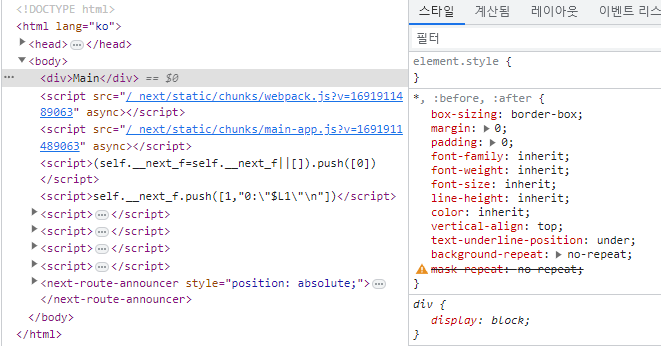
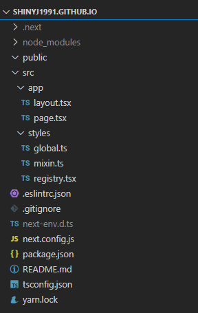

## Blog styling

이 글은 `next.js` 블로그에 `styled-components` 라이브러리를 적용하는 방법에 대해 설명하고 있습니다.

### styled-components

`styled-components` 란 javascript (or typescript) 파일 내에서 CSS를 사용하게 해주는 CSS-in-JS 라이브러리로 React환경에서 주로 사용됩니다.
우리가 사용하고 있는 `next.js` 도 React 기반이기 때문에 `styled-components`를 사용하도록 하겠습니다.
터미널에서 아래 명령어를 입력하여 블로그에 `styled-components`를 추가해줍니다.

```
yarn add styled-components
```

### mixin.ts

`style` 파일들이 위치할 `/src/styles` 폴더를 생성한 후 `mixin.ts` 파일을 생성해줍니다.
`mixin.ts` 파일은 공통 스타일 변수를 모아놓겠습니다. 파일명은 마음에드는 단어로 바꾸셔도 상관 없습니다.
그다음 브라우저 기본 스타일을 초기화 해주는 `reset`이라는 스타일 변수를 만들었습니다.

```ts:/src/styles/mixin.ts
import { css } from 'styled-components';

export const reset = css`
  box-sizing: border-box;
  margin: 0;
  padding: 0;
  font-family: inherit;
  font-weight: inherit;
  font-size: inherit;
  line-height: inherit;
  color: inherit;
  vertical-align: top;
  text-underline-position: under;
  background-repeat: no-repeat;
  mask-repeat: no-repeat;
`;
```

### global.ts

`/src/styles/global.ts` 파일을 생성해줍니다.
블로그 전역에 영향을 미치는 스타일 파일입니다.
아래와 같이 작성해줬습니다.

```ts:/src/styles/global.ts
import { createGlobalStyle } from 'styled-components';
import { reset } from '@/styles/mixin';

export const GlobalStyle = createGlobalStyle`
  *,
  :before,
  :after {
    ${reset};
  }
  html {
    scroll-behavior: smooth;
  }
  body {
    font-family: 'Noto Sans KR', sans-serif;
    font-weight: 400;
    font-size: 16px;
    line-height: 1.5;
    color: #000;
    background: #fff;
    -webkit-text-size-adjust: 100%;
    min-width: 320px;
    &.is-mobile {
      font-size: 12px;
    }
    &.is-scroll-lock {
      overflow: hidden;
    }
  }
  ol,
  ul {
    list-style: none;
  }
  table {
    width: 100%;
    border-spacing: 0;
    table-layout: fixed;
  }
  th,
  td {
    text-align: center;
    vertical-align: middle;
  }
  a {
    text-decoration: none;
  }
  button {
    border: none;
    border-radius: 0;
    background: none;
    appearance: none;
    cursor: pointer;
  }
`;
```

### FOUC 방지

#### FOUC란?

`FOUC(Flash of unstyled content)` 란 스타일이 적용되지 않은 상태로 화면이 잠시간 노출되는 현상을 일컫습니다.

이는 next.js의 hydrate 과정에서 렌더링 이후 style을 그려 발생하는 현상인데 next.js 공식사이트에서 제공하는 해결법은 아래와 같습니다. (next.js 13버전 기준입니다.)

우선 `/src/styles/registry.tsx` 파일을 생성하고 아래 코드를 작성해줍니다.
(확장자를 잘 확인해주세요.)

```tsx:/src/styles/registry.tsx
'use client';

import React, { useState } from 'react';
import { useServerInsertedHTML } from 'next/navigation';
import { ServerStyleSheet, StyleSheetManager } from 'styled-components';

export default function StyledComponentsRegistry({
  children,
}: {
  children: React.ReactNode;
}) {
  const [styledComponentsStyleSheet] = useState(() => new ServerStyleSheet());

  useServerInsertedHTML(() => {
    const styles = styledComponentsStyleSheet.getStyleElement();
    styledComponentsStyleSheet.instance.clearTag();
    return <>{styles}</>;
  });

  if (typeof window !== 'undefined') return <>{children}</>;

  return (
    <StyleSheetManager sheet={styledComponentsStyleSheet.instance}>
      {children}
    </StyleSheetManager>
  );
}
```

그리고 `/src/app/layout.tsx` 파일을 아래와 같이 수정해줍니다.

```tsx:/src/app/layout.tsx
import type { Metadata } from "next";
import StyledComponentsRegistry from "@/styles/registry";

interface Props {
  children: React.ReactNode;
}

export const metadata: Metadata = {
  title: "Create Next App",
  description: "Generated by create next app",
};

const RootLayout = ({ children }: Props) => {
  return (
    <html lang="ko">
      <body>
        <StyledComponentsRegistry>{children}</StyledComponentsRegistry>
      </body>
    </html>
  );
};

export default RootLayout;
```

`/src/styles/registry.tsx` 파일에 위에서 만든 `global.ts` 스타일을 적용해줍니다.

```tsx:/src/styles/registry.tsx
"use client";

import React, { useState } from "react";
import { useServerInsertedHTML } from "next/navigation";
import { ServerStyleSheet, StyleSheetManager } from "styled-components";
import { GlobalStyle } from "@/styles/global";

export default function StyledComponentsRegistry({
  children,
}: {
  children: React.ReactNode;
}) {
  const [styledComponentsStyleSheet] = useState(() => new ServerStyleSheet());

  useServerInsertedHTML(() => {
    const styles = styledComponentsStyleSheet.getStyleElement();
    styledComponentsStyleSheet.instance.clearTag();
    return <>{styles}</>;
  });

  if (typeof window !== "undefined") return <>{children}</>;

  return (
    <StyleSheetManager sheet={styledComponentsStyleSheet.instance}>
      <GlobalStyle />
      {children}
    </StyleSheetManager>
  );
}
```

편의를 위해 `next.config.js` 파일에 아래 옵션을 추가해 줍니다.

```js:/next.config.js
/** @type {import('next').NextConfig} */
const nextConfig = {
  compiler: {
    styledComponents: {
      ssr: true,
      displayName: true, // 클래스명에 컴포넌트 이름을 붙임
      pure: true, // dead code elimination (사용되지 않는 속성 제거)
    },
  },
};

module.exports = nextConfig;
```

여기까지 수정한 후 로컬서버를 실행시키면 DOM요소에 전역 스타일이 잘 반영된 것을 확인할 수 있습니다.



만약 오류가 발생한다면 코드에서 틀린부분이 없는지 혹은 라이브러리 버전이 크게 달라지지 않았는지 확인하시기 바랍니다.


