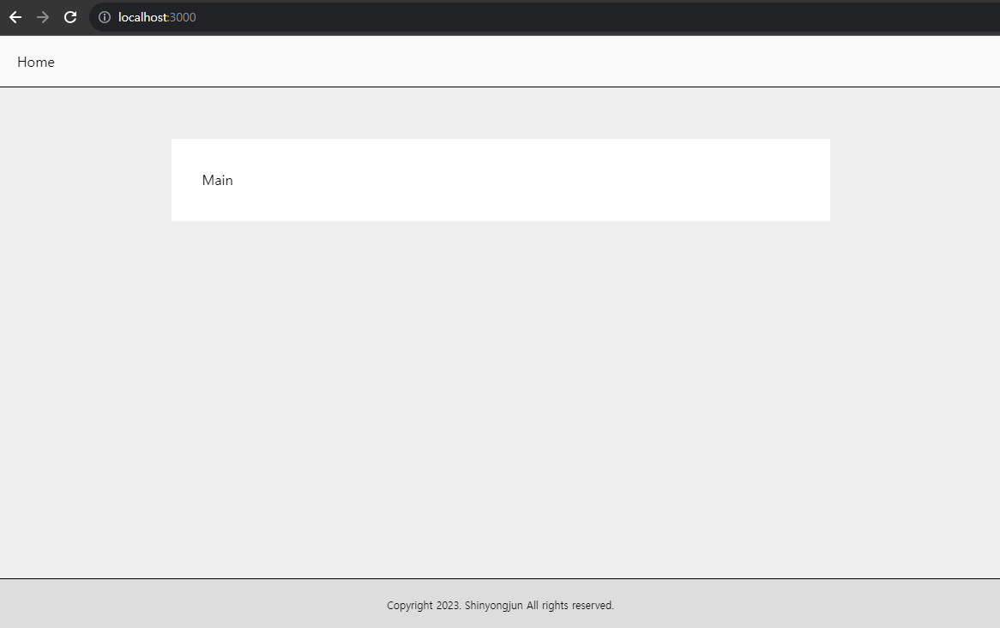
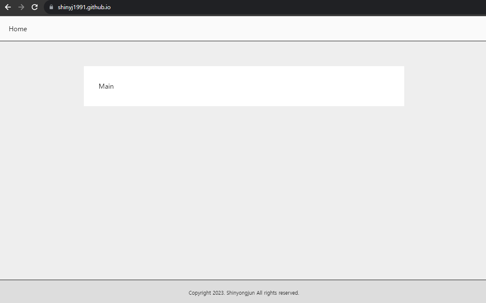
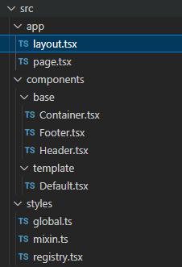

## Blog Layout 구성

이 글은 Blog의 Layout을 구성할 component를 만들고 `styled-components` 를 사용한 component styling 예제 코드가 포함되어 있습니다.

### base component 생성

Layout을 구성할 base component를 생성합니다.
`Header`, `Footer` 그리고 `Container` component를 만들어 주겠습니다.
`styled-components` 코드는 component 파일 하단에 위치해주었습니다.
code block 위 파일명을 잘 보시고 따라하시기 바랍니다.

```tsx:/src/components/base/Header.tsx
"use client";

import styled from "styled-components";
import Link from "next/link";

function BaseHeader() {
  return (
    <StyledBaseHeader>
      <nav className="gnb">
        <Link href="/">Home</Link>
      </nav>
    </StyledBaseHeader>
  );
}

const StyledBaseHeader = styled.header`
  backdrop-filter: blur(5px);
  -webkit-backdrop-filter: blur(5px);
  display: flex;
  align-items: center;
  height: 60px;
  padding: 0 24px;
  border-bottom: 1px solid #000;
  position: fixed;
  top: 0;
  left: 0;
  right: 0;
  z-index: 100;
  background-color: rgba(255, 255, 255, 0.7);
  overflow-x: auto;
  .gnb {
    display: flex;
    column-gap: 30px;
    a {
      font-family: "Roboto";
      font-size: 16px;
    }
  }
`;

export default BaseHeader;
```

```tsx:/src/components/base/Footer.tsx
'use client';

import styled from 'styled-components';

function BaseFooter() {
  return (
    <StyledBaseFooter>
      <p className="copyright">
        Copyright 2023. Shinyongjun All rights reserved.
      </p>
    </StyledBaseFooter>
  );
}

const StyledBaseFooter = styled.footer`
  position: absolute;
  right: 0;
  left: 0;
  bottom: 0;
  height: 60px;
  border-top: 1px solid #000;
  background-color: #ddd;
  display: flex;
  align-items: center;
  justify-content: center;
  .copyright {
    font-size: 12px;
    color: #000;
  }
`;

export default BaseFooter;
```

```tsx:/src/components/base/Container.tsx
"use client";

import styled from "styled-components";

type Props = {
  children: React.ReactNode;
};

function BaseContainer({ children }: Props) {
  return <StyledBaseContainer>{children}</StyledBaseContainer>;
}

const StyledBaseContainer = styled.main`
  max-width: 768px;
  margin-inline: auto;
  padding: 36px;
  margin-block: 60px;
  background-color: #fff;
`;

export default BaseContainer;
```

### template component 생성

다음으로 template component를 생성해줍니다.

```tsx:/src/components/template/Default.tsx
"use client";

import styled from "styled-components";
import BaseContainer from "@/components/base/Container";
import BaseHeader from "@/components/base/Header";
import BaseFooter from "@/components/base/Footer";

type Props = {
  children: React.ReactNode;
};

function DefaultTemplate({ children }: Props) {
  return (
    <StyledDefaultTemplate>
      <BaseHeader />
      <BaseContainer>{children}</BaseContainer>
      <BaseFooter />
    </StyledDefaultTemplate>
  );
}

const StyledDefaultTemplate = styled.div`
  position: relative;
  min-height: 100vh;
  padding-block: 60px;
  background-color: #eee;
`;

export default DefaultTemplate;
```

### template 적용

생성한 template component를 app에 적용합니다.

```tsx:/src/app/layout.tsx
import type { Metadata } from "next";
import StyledComponentsRegistry from "@/styles/registry";
import DefaultTemplate from "@/components/template/Default";

interface Props {
  children: React.ReactNode;
}

export const metadata: Metadata = {
  title: "Create Next App",
  description: "Generated by create next app",
};

const RootLayout = ({ children }: Props) => {
  return (
    <html lang="ko">
      <body>
        <StyledComponentsRegistry>
          <DefaultTemplate>{children}</DefaultTemplate>
        </StyledComponentsRegistry>
      </body>
    </html>
  );
};

export default RootLayout;
```

결과화면이 아래 화면처럼 보이면 정상입니다.



main branch 에 push 해보니 배포까지 정상동작합니다.




