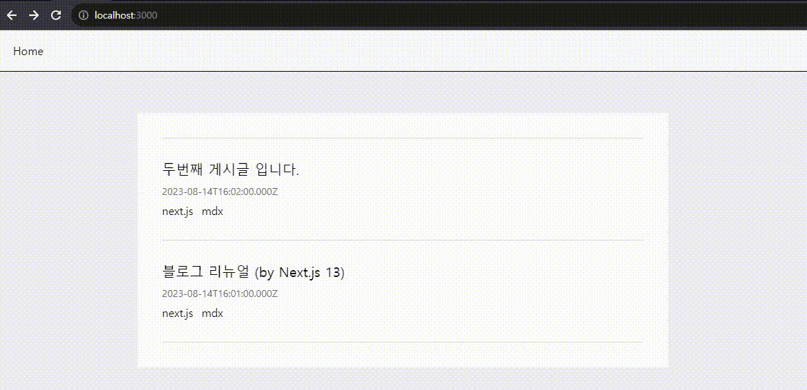
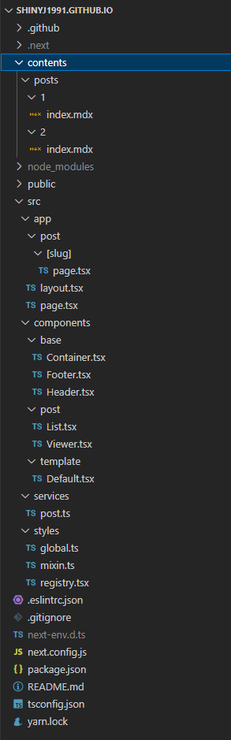

이 글에서는 `Next.js` 의 동적 라우팅과 정적 페이지 생성 기능을 이용하여 블로그 포스팅 상세페이지를 만드는 방법을 다뤄보겠습니다.

기능 구현 순서는 다음과 같습니다.

1. 상세 페이지를 그릴 `PostViewer` 컴포넌트 생성
2. `slug` 값을 참조하여 post 객체를 추출해주는 `getPost` 함수 생성
3. 동적 라우팅 컴포넌트 생성 (`/app/post/[slug]/page.tsx`)

### PostViewer 컴포넌트 생성

`/src/components/post/Viewer.tsx` 파일을 생성해 PostViewer 컴포넌트를 만들어 주겠습니다.

```tsx:/src/components/post/Viewer.tsx
"use client";

import styled from "styled-components";
import { MDXRemote } from "next-mdx-remote";
import { Post } from "@/services/post";

interface Props {
  postData: Post;
}

function PostViewer({ postData }: Props) {
  return (
    <>
      <StyledPostViewer>
        <header className="post-header">
          <h1 className="post-title">{postData.title}</h1>
          <div className="post-categories">
            {postData.categories.map((category) => {
              return <div key={category}>{category}</div>;
            })}
          </div>
          <div className="post-date">{postData.date.toISOString()}</div>
        </header>
        <div className="post-content">
          <MDXRemote {...postData.mdx} />
        </div>
      </StyledPostViewer>
    </>
  );
}

const StyledPostViewer = styled.article`
  .post-header {
    text-align: center;
    margin-bottom: 60px;
    .post-title {
      font-weight: 700;
      font-size: 30px;
      margin-bottom: 12px;
    }
    .post-categories {
      display: flex;
      flex-wrap: wrap;
      justify-content: center;
      gap: 12px;
    }
    .post-date {
      margin-top: 12px;
      color: #666;
      font-size: 14px;
    }
  }
`;

export default PostViewer;
```

- `MDXRemote` 는 mdx 파일의 내용을 렌더링 해줍니다.

### getPost 함수 생성

이제 `getPostList` 가져온 포스팅 목록 중에서 `slug` 가 일치하는 포스팅만 추출하는 `getPost` 함수를 만들겠습니다.

```ts:/src/services/post.ts
export const getPost = async (slug: string) => {
  const postList = await getPostList();
  const postIndex = postList.findIndex((post) => post?.slug === slug);

  return {
    post: postList[postIndex],
  };
};
```

`/src/services/post.ts` 파일의 전체 코드는 아래와 같습니다.

```ts:/src/services/post.ts
import path from "path";
import fs from "fs";
import { sync } from "glob";
import { MDXRemoteSerializeResult } from "next-mdx-remote";
import matter from "gray-matter";
import { serialize } from "next-mdx-remote/serialize";

const BASE_PATH = "/contents/posts";
const POSTS_PATH = path.join(process.cwd(), BASE_PATH);

interface PostMatter {
  title: string;
  date: Date;
  categories: string[];
}

export interface Post extends PostMatter {
  slug: string;
  mdx: MDXRemoteSerializeResult;
}

const parsePost = async (postPath: string): Promise<Post> => {
  const file = fs.readFileSync(postPath, "utf8");
  const { data, content } = matter(file);
  const grayMatter = data as PostMatter;
  const slug = postPath
    .slice(postPath.indexOf(BASE_PATH))
    .replace(`${BASE_PATH}/`, "")
    .replace("/index.mdx", "");
  const mdx = await serialize(content, {
    mdxOptions: {
      remarkPlugins: [],
      rehypePlugins: [],
      format: "mdx",
    },
  });

  return {
    ...grayMatter,
    slug,
    mdx,
  };
};

export const getPostList = async (): Promise<Post[]> => {
  const postPaths: string[] = sync(`${POSTS_PATH}/**/*.mdx`);
  const result = await Promise.all(
    postPaths.map((postPath) => {
      return parsePost(postPath);
    })
  );

  return result.sort((a: Post, b: Post) => {
    const dateA = a.date;
    const dateB = b.date;

    if (dateA > dateB) return -1;
    if (dateA < dateB) return 1;
    return 0;
  });
};

export const getPost = async (slug: string) => {
  const postList = await getPostList();
  const postIndex = postList.findIndex((post) => post?.slug === slug);

  return {
    post: postList[postIndex],
  };
};
```

### 동적 라우팅 컴포넌트 생성

마지막으로 `app` 폴더 하위에 동적 라우팅 컴포넌트를 생성하겠습니다.
`Next.js` 에서 동적 라우팅 컴포넌트를 만드려면 폴더명을 `[]` 대괄호로 감싸줍니다.

```tsx:/src/app/post/[slug]/page.tsx
import { getPost, getPostList } from "@/services/post";
import PostViewer from "@/components/post/Viewer";

type Props = {
  params: {
    slug: string;
  };
};

export async function generateStaticParams() {
  const postList = await getPostList();

  return postList.map((post) => ({
    slug: post.slug,
  }));
}

const PostViewPage = async ({ params }: Props) => {
  const { slug } = params;
  const { post } = await getPost(slug);

  return (
    <>
      <PostViewer postData={post} />
    </>
  );
};

export default PostViewPage;
```

- `generateStaticParams` 함수는 `SSG` 빌드 시 실행되며 반환되는 목록을 참조하여 정적 페이지를 생성해주는 `Next.js` 함수입니다.

### 결과 화면

여기까지 잘 따라오셨다면 아래와 같은 결과 화면을 확인할 수 있습니다.




