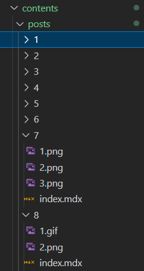
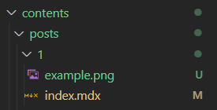

이 글에서는 `next-mdx-remote` 모듈의 `plugin` 기능을 사용하여 상세페이지에 `img` 를 삽입해 보도록 하겠습니다.

### 구현 요건

구현하고자 하는 요건은 다음과 같습니다.

1. `mdx`, `img` 파일은 같은 폴더에서 한번에 관리할 수 있도록 한다.
2. `mdx` 내부에서 `img` 파일을 호출할 땐 상대경로를 사용한다.



```md:example.mdx
같은 경로의 이미지파일은 이렇게 불러옵니다.

or

```

### 이미지 처리 플러그인 생성

코드를 작성하기에 앞서 `unist-util-visit` 모듈을 설치해줍니다.
마크다운 문서에서 코드 블록을 찾거나 조작하는데 사용하는 모듈입니다.

```
yarn add unist-util-visit
```

그다음 `/src/services/mdx.ts` 파일을 만들어 아래 코드를 작성해줍니다.

```ts:/src/services/mdx.ts
import fs from "fs";
import { visit } from "unist-util-visit";
import { Node, Parent } from "unist";
import { getExtensionOfFilename } from "@/utils/file";

type Image = {
  type: string;
  url: string;
  alt: string;
};

export const transformImgSrc = ({
  slug,
  path,
}: {
  slug: string;
  path: string;
}) => {
  return (tree: Node) => {
    visit(tree, "paragraph", (node: Parent) => {
      const image = node.children.find(
        (child: { type: string }) => child.type === "image"
      ) as Image | undefined;

      if (image === undefined) return;

      const fileName = image.url.replace("./", "");
      const imageUrl = `${path}/${slug}/${fileName}`;
      const imageBuffer = fs.readFileSync(imageUrl);
      const base64String = imageBuffer.toString("base64");
      const extension = getExtensionOfFilename(fileName);
      image.url = `data:image/${extension};base64,${base64String}`;
    });
  };
};
```

코드 내부에 사용된 `getExtensionOfFilename` 라는 함수는 파일명에서 확장자를 추출해 주는 함수입니다.
`utils` 폴더 내부에 만들어 주겠습니다.

```ts:/src/utils/file.ts
export const getExtensionOfFilename = (filename: string) => {
  const lastDotIndex = filename.lastIndexOf(".");

  if (lastDotIndex === -1) {
    return "";
  }

  const extension = filename.slice(lastDotIndex + 1);
  return extension;
};
```

### 플러그인 적용

이제 위에서 만든 `transformImgSrc` 라는 플러그인을 `next-mdx-remote`에 적용하겠습니다.
`remarkPlugins` 구문에 `transformImgSrc` 함수를 적용했습니다.

```ts:/src/services/post.ts
...

const parsePost = async (postPath: string): Promise<Post> => {
  const file = fs.readFileSync(postPath, "utf8");
  const { data, content } = matter(file);
  const grayMatter = data as PostMatter;
  const slug = postPath
    .slice(postPath.indexOf(BASE_PATH))
    .replace(`${BASE_PATH}/`, "")
    .replace("/index.mdx", "");
  const mdx = await serialize(content, {
    mdxOptions: {
      remarkPlugins: [[transformImgSrc, { slug, path: POSTS_PATH }]],
      rehypePlugins: [],
      format: "mdx",
    },
  });

  return {
    ...grayMatter,
    slug,
    mdx,
  };
};

...
```

### mdx 파일에 이미지 파일 호출

이제 이미지 파일을 `index.mdx` 파일과 같은 경로에 위치시킵니다.



그다음 mdx 파일에서 이미지를 호출합니다.

```md:/contents/posts/1/index.mdx
---
title: 블로그 리뉴얼 (by Next.js 13)
date: 2023-08-14T16:01:00
categories: ["next.js", "mdx"]
---

## 인사말

안녕하세요. 이 글은 mdx파일로 작성되었습니다.


```

아래 결과화면처럼 이미지가 불러와지는것을 확인할 수 있습니다.


