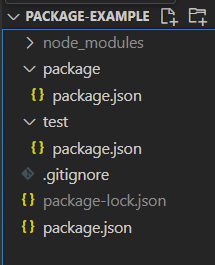

### 시리즈 소개

이번 시리즈 포스팅에서는 npm package를 제작하는 방법과 제작한 package를 npm registry에 배포하는 방법을 정리해보겠습니다.

### Npm Package란?

npm package란 node.js 환경에서 사용할 수 있는 응용 프로그램 입니다. 패키지, 라이브러리, 모듈 등 여러 이름으로 불리고 있으며 이 포스팅에선 패키지 라는 단어로 통일하도록 하겠습니다.

### Npm Registry란?

npm이 package를 저장하고 관리하는 공간입니다. registry에 업로드 된 package들은 `npm install {package name}` 명령어를 사용하여 프로젝트에 다운로드 받을 수 있습니다.

### 만들어 볼 패키지

몇가지 CSS속성이 적용된 React Component 하나를 만들겠습니다.
복잡한 비즈니스 로직을 구현하는것이 목적이 아니기 때문에 개발환경을 구축하고 CSS를 적용하고 결과물을 컴파일하는 것에 포커스를 맞추려 합니다.

### npm init

작업을 시작할 폴더를 하나 만들고 `npm init -y` 터미널에 명령어를 입력하여 `package.json` 파일을 생성합니다.

```
npm init -yarn
```

```json:package.json
{
  "name": "package-example",
  "version": "1.0.0",
  "description": "",
  "main": "index.js",
  "scripts": {
    "test": "echo \"Error: no test specified\" && exit 1"
  },
  "keywords": [],
  "author": "",
  "license": "ISC"
}
```

`monorepo`를 사용하여 패키지 제작 환경과 테스트 환경을 구축하겠습니다.
터미널에 `npm init -y --workspace package` 명령어를 입력하면 root 경로에 `package`라는 폴더가 생성되고 `package.json` 파일에는 `workspaces`라는 옵션이 추가됩니다.

```
npm init -y --workspace package
```

```
{
  "name": "package-example",
  "version": "1.0.0",
  "description": "",
  "main": "index.js",
  "scripts": {
    "test": "echo \"Error: no test specified\" && exit 1"
  },
  "keywords": [],
  "author": "",
  "license": "ISC",
  "workspaces": [
    "package"
  ]
}
```

### monorepo란?

`monorepo`란 `monolithic repositories`의 줄임말로 하나의 저장소에서 여러개의 프로젝트를 관리하는 방식을 말합니다. 패키지 제작 환경을 구축할 땐 `패키지 프로젝트`와 `테스트 프로젝트` 두가지 개발환경이 필요하기 때문에 monorepo 방식을 사용했습니다.

### /package

생성된 `/package`는 npm registry에 배포할 패키지를 제작하는 디렉토리입니다.

### /test

같은 방법으로 `test` workspace를 만들겠습니다.
`--workspace` 옵션은 `-w` 로 축약할 수 있습니다.

```
npm init -y -w test
```

```
{
  "name": "package-example",
  "version": "1.0.0",
  "description": "",
  "main": "index.js",
  "scripts": {
    "test": "echo \"Error: no test specified\" && exit 1"
  },
  "keywords": [],
  "author": "",
  "license": "ISC",
  "workspaces": [
    "package",
    "test"
  ]
}
```

### .gitignore

마지막으로 `.gitignore` 파일을 추가해줍니다.
Github 저장소에 의존성 패키지 파일과 결과물이 올라가는것을 방지해주는 역할을 합니다.

```txt:.gitignore
# See https://help.github.com/articles/ignoring-files/ for more about ignoring files.

# dependencies
node_modules

# production
dist

# lock
yarn.lock
package-lock.json
```



end.
