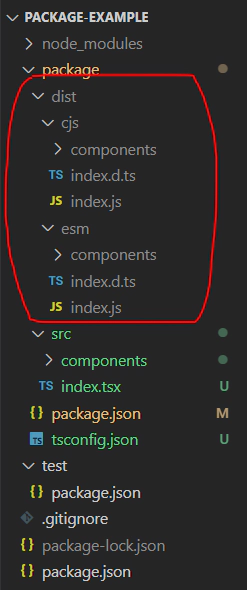

### React 개발 환경 구성

React Component를 제작해기 위해서 React 개발 환경을 구축하겠습니다.
설치할 패키지들은 아래와 같습니다.

- @types/node
- @types/react
- @types/react-dom
- react
- react-dom
- typescript

기술한 패키지들은 모두 `devDependencies`로 설치합니다.
설치 명령어를 `monorepo`에서 실행할 경우 명령어 후미에 `-w package` 옵션을 추가합니다.

```
npm install -D @types/node @types/react @types/react-dom react react-dom typescript -w package
```

### Package name

`/package/package.json` 파일의 `name`값에 패키지 이름을 설정해줍니다.
패키지 이름은 나중에 `npm install {package name}` 명령어에 사용되며 `npm registry` 에 올라오지 않은 유니크한 이름이어야 합니다. 전 `@shinyongjun/package-example` 이라는 이름을 사용했습니다. 여기에서 `@shinyongjun` 은 스코프 개념이며 일종의 그룹핑이라고 보시면 됩니다.

```json:/package/package.json
{
  "name": "@shinyongjun/package-example",
  "version": "1.0.0",
  "description": "",
  "main": "index.js",
  "scripts": {
    "test": "echo \"Error: no test specified\" && exit 1"
  },
  "keywords": [],
  "author": "",
  "license": "ISC",
  "devDependencies": {
    "@types/node": "^20.5.7",
    "@types/react": "^18.2.21",
    "@types/react-dom": "^18.2.7",
    "react": "^18.2.0",
    "react-dom": "^18.2.0",
    "typescript": "^5.2.2"
  }
}
```

### tsconfig.json

`tsconfig.json` 은 타입스크립트를 자바스크립트로 컴파일할 때의 설정을 정의해놓는 파일입니다.
`/package/tsconfig.json` 파일을 생성하고 아래 코드를 붙여넣습니다. 각 옵션에 대한 자세한 설명은 <PostOutlink href="https://json.schemastore.org/tsconfig">여기</PostOutlink> 링크를 참고하시기 바랍니다.

```json:/package/tsconfig.json
{
  "compilerOptions": {
    "declaration": true,
    "esModuleInterop": true,
    "isolatedModules": true,
    "jsx": "react",
    "moduleResolution": "node",
    "noUncheckedIndexedAccess": true,
    "outDir": "dist",
    "strict": true,
    "target": "es5"
  },
  "include": ["src/**/*.ts", "src/**/*.tsx"]
}
```

### React Component

React Component를 하나 만들어서 export 해보겠습니다.

```tsx:/package/src/component/TestComponent.tsx
import * as React from "react";

function TestComponent() {
  return <div>Test Component</div>;
}

export default TestComponent;
```

```tsx:/package/src/index.tsx
export { default as TestComponent } from "./components/TestComponent";
```

### build

위에 만든 React Component를 자바스크립트로 컴파일 해주겠습니다. node.js 에는 `CommonJS`, `ECMAScript Modules`라는 두 가지 모듈 시스템이 존재합니다. 이 두가지 모듈시스템을 모두 지원하는 라이브러리를 만들기위해선 빌드를 두번 해주어야 합니다.

두가지 모듈시스템을 모두 지원해야하는 이유는 아래 토스팀에서 작성한 블로그글을 참고하시기 바랍니다.

<PostOutlink href="https://toss.tech/article/commonjs-esm-exports-field">
  CommonJS와 ESM에 모두 대응하는 라이브러리 개발하기: exports field
</PostOutlink>

`package.json` 에 아래 스크립트를 추가합니다.
`build:esm` 명령어는 ESM 모듈, `build:cjs` 명령어는 CommonJS 모듈에 대응하는 결과물을 빌드합니다.

```json:/package/package.json
{
  ...
  "scripts": {
    "build": "npm run build:esm && npm run build:cjs",
    "build:esm": "tsc --outDir dist/esm --module esnext",
    "build:cjs": "tsc --outDir dist/cjs --module commonjs"
  },
  ...
}
```

```
npm run build -w package
```

빌드를 실행하면 아래와 같은 결과물이 생성됩니다.



end.
