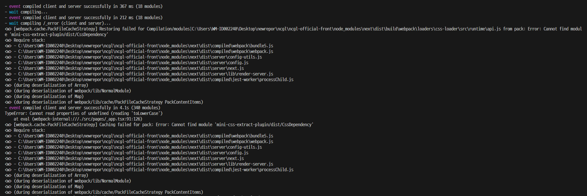

### 에러 상황

next.js 실행 하니 `Error: Cannot find module 'mini-css-extract-plugin/dist/CssDependency'` 에러가 발생했습니다.



### 해결 방법

어떤 이유인진 모르겠지만 `next.config.js` 파일에 `reactStrictMode` 옵션을 `true`로 설정해주니 해결되었습니다.

```js:/next.config.js
/** @type {import('next').NextConfig} */
const nextConfig = {
  reactStrictMode: true,
};

module.exports = nextConfig;
```

end.
