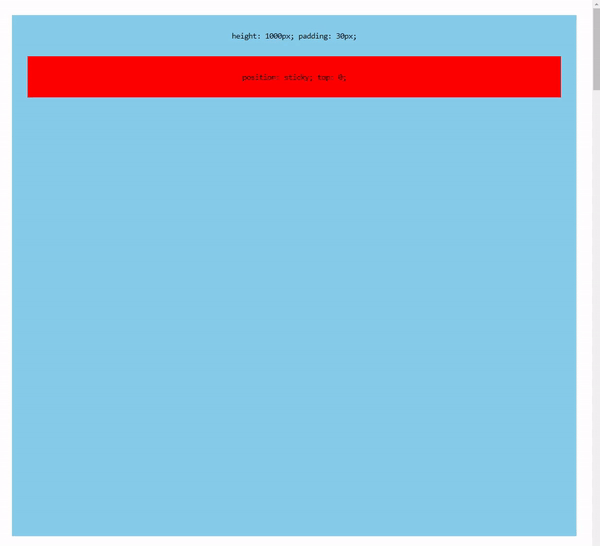

### position: sticky

`position: sticky` 는 페이지 스크롤시 해당 요소를 고정시키는 기능을 수행합니다.
얼핏 `position: fixed` 와 기능이 비슷해 보일 수 있지만 `fixed` 는 화면 전체를, `sticky` 는 부모 영역을 기준으로 고정된다는 점이 다릅니다.
또한 `sticky` 는 `fixed` 와 다르게 사용시 주의할 점들이 많은데 이것을 지키지 않고 사용하면 제대로 동작하지 않습니다.

### 주의사항1 - overflow

요약 : `sticky` 을 적용한 요소의 부모 요소들 중 하나라도 `visible` 을 제외한 `overflow` 값 이 있을 경우 동작하지 않습니다.

`sticky` 가 동작하는 방식은 부모 요소와 관련이 깊은데, 이 속성은 부모 요소 중에서 스크롤 컨테이너를 찾아서 그 기준으로 합니다.
`overflow: hidden` 은 부모 요소의 내용이 넘칠 때 스크롤 바를 숨기는 속성이지만, 해당 부모 요소를 스크롤 컨테이너로 삼지 않고 내용을 숨기는 특성이 있습니다.

따라서 `sticky` 를 사용할 때 부모 요소 중에 `overflow: hidden` 이 있는 경우, 부모 요소가 스크롤 컨테이너로 적절히 동작하지 않아 `sticky` 가 제대로 동작하지 않을 수 있습니다. 이 경우에는 `overflow: hidden` 을 사용하는 대신에 다른 방법으로 레이아웃을 조정하거나 스크롤 컨테이너를 명시적으로 지정하여 해결해야 합니다.

### 주의사항2 - height

`sticky` 가 동작하지 않는다면 부모 요소의 `height` 값이 또다른 원인일 수 있습니다.
`sticky` 요소는 부모 요소의 영역 안에서만 고정되기 때문에 충분한 높이가 확보되지 않았다면 동작하지 않는 것처럼 보입니다.

부모 요소의 높이를 길게 확보해주면 정상 동작하는 것을 확인할 수 있습니다.

