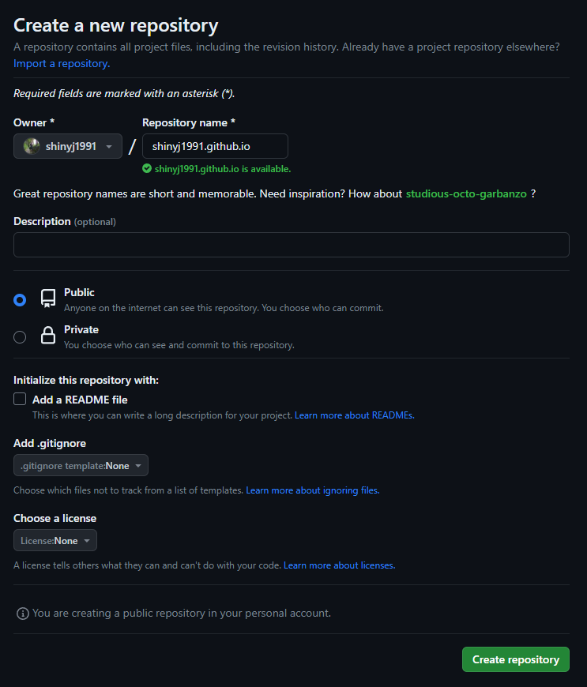
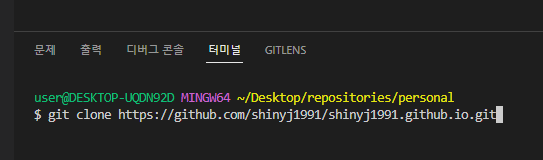
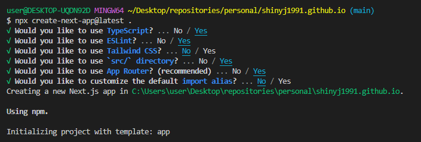
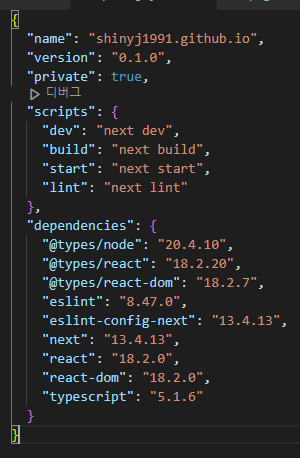
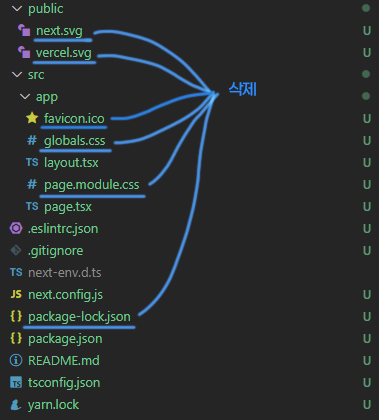
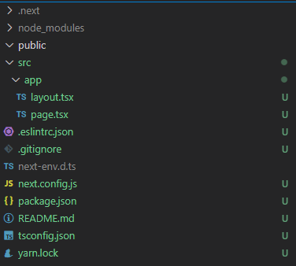
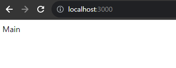

## 시작하며

이 글은 `Next.js`를 사용한 `Github Page` `markdown` 블로그를 만드는법을 공유합니다.
2023년 8월을 기준으로 작성되었으며 시리즈물로 기획되었습니다.

### 필요한 기반 지식

이 글은 Frontend 개발자를 대상으로 작성했습니다. html, css, javascript, typescript, git, react, node, npm 에 대한 지식을 어느정도 가지고 있어야 문제없이 따라올 수 있습니다.

### Next.js란?

Next.js는 React 기반의 SSR 프레임워크 입니다.
Github Page 로 블로그를 운영하기 위해선 Next.js의 `SSG` 기능을 사용하여 정적 웹사이트 결과물을 빌드 해야 합니다.

### Github Page란?

Github에서 제공하는 정적 웹사이트 호스팅 서비스로서 유저가 Repository에 코드를 올려 웹서비스를 제공할 수 있게 해줍니다.
이 글의 최종 목표는 저장소 내에 마크다운 파일을 업로드하여 블로그서비스를 운영하는데 있습니다.

## 프로젝트 및 저장소 생성

### Github Repository 생성

Github 접속 후 블로그 서비스를 운영할 Repository를 생성합니다.
Github Page는 유저마다 하나의 기본 도메인을 제공하는데 도메인 형식은 아래와 같습니다.

```
[UserID].github.io
```

제 github id는 shinyj1991 이므로 기본 도메인은 shinyj1991.github.io 가 되겠습니다.

기본 도메인을 사용하기 위해선 Repository의 이름을 기본 도메인과 동일하게 생성해야 합니다.
Github Page 운영 정책에 따라 저장소 공개 설정은 `Public` 으로 체크해줍니다.



### Repository Clone

Repository를 Local에 Clone합니다.



### Install Next.js

Repository를 Clone한 폴더로 이동하여 Next.js 를 설치해 줍니다.
새 폴더를 만들지 않고 현재 경로에 설치하기 위해선 설치명령어 후미에 `.`을 넣어주면 됩니다.

```
npx create-next-app@latest .
```



아래는 이 글에서 사용된 next.js와 모듈들의 버전 정보입니다.



`next.js`의 설치가 끝났으면 불필요한 파일들을 삭제해줍니다.



그 후 `/src/app/layout.tsx`, `/src/app/page.tsx` 파일의 코드도 아래처럼 정리해 주겠습니다.

```tsx:src/app/layout.tsx
import type { Metadata } from "next";

interface Props {
  children: React.ReactNode;
}

export const metadata: Metadata = {
  title: "Create Next App",
  description: "Generated by create next app",
};

const RootLayout = ({ children }: Props) => {
  return (
    <html lang="ko">
      <body>{children}</body>
    </html>
  );
};

export default RootLayout;
```

```tsx:src/app/page.tsx
function RootPage() {
  return <div>Main</div>;
}

export default RootPage;
```

### Install Package

이제 node module을 설치해줍니다.
저는 node `18.16.0` 버전과 패키지 매니저는 `yarn`을 사용하고 있습니다.

```
yarn
```

아래는 프로젝트의 최종 모습입니다.



### next dev

설치까지 끝났으면 localhost에 웹을 띄워보겠습니다.

```
yarn dev
```



위와같이 결과 페이지가 올라오지 않는다면 천천히 앞 단계를 다시 확인하시기 바랍니다.
