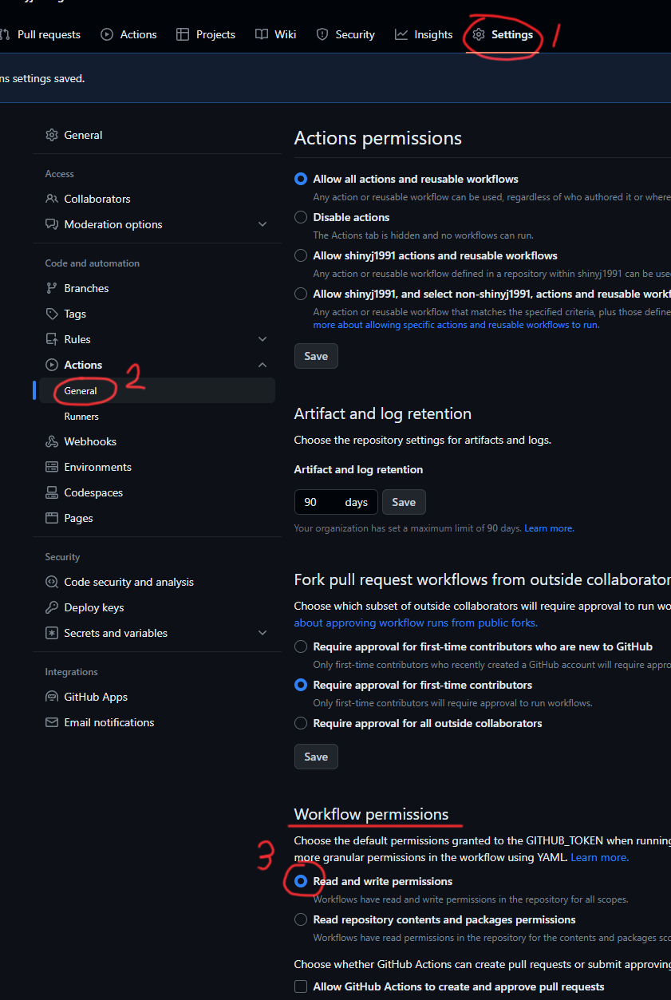
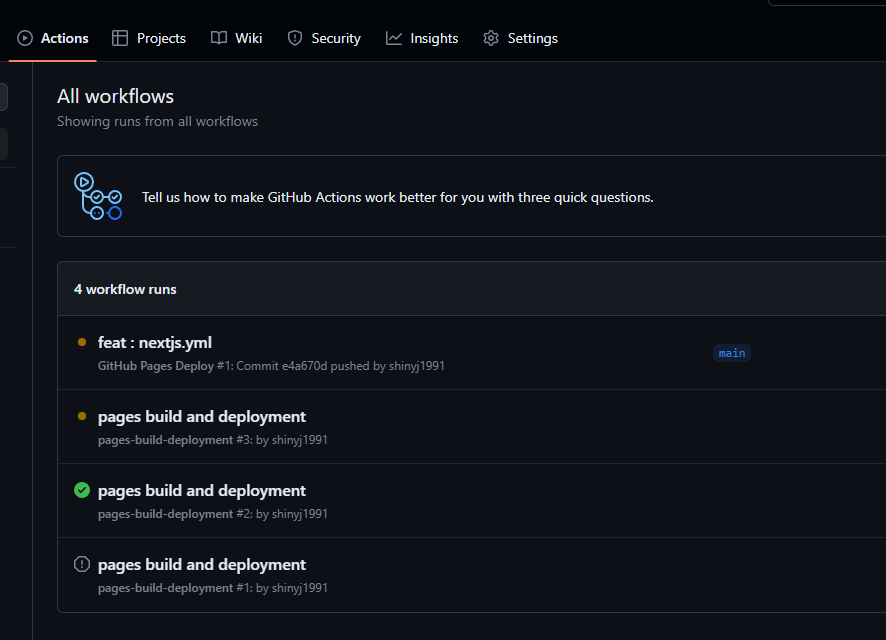
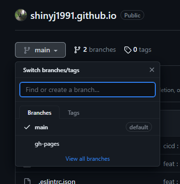
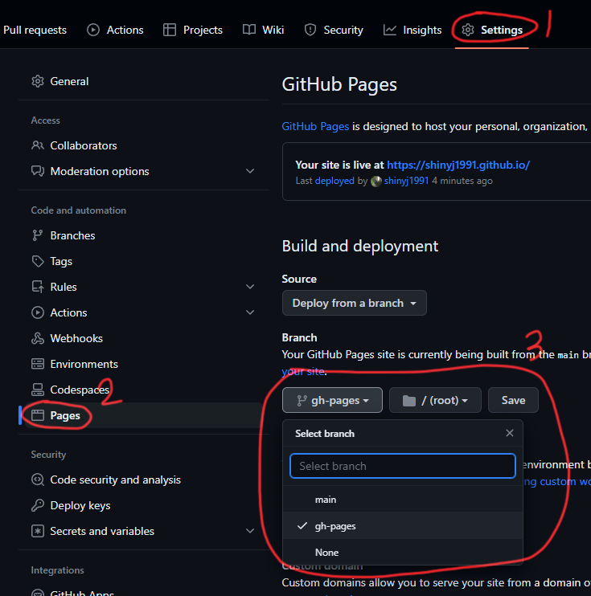

## Github Page 배포 및 설정

이 글은 Github에서 제공하는 CI/CD 툴인 `Github Actions` 를 사용하여 `next.js` 앱을 배포하는 일련의 과정을 설명합니다.

### 빌드 와 배포

방법을 설명하기 앞서 앱이 빌드되고 배포되는 과정을 간략히 설명해드리겠습니다.

1. `main` branch 에 push가 이루어집니다.
2. `Github Actions`이 `push event`를 감지하여 일련의 배포 프로세스(jobs)를 시작합니다.
3. 가상 머신에서 `main` branch 에 있는 코드를 빌드합니다.
4. 빌드된 정적 html 파일을 `Github Page` 에서 서비스 할 branch에 배포합니다.
   (default : gh-pages)

이제 `/.github/workflows/nextjs.yml` 파일을 생성한 후 아래 코드를 입력합니다.
아래 yml 파일은 `Github Actions` 에서의 동작을 관리합니다.

※ 아래 코드 중 `touch ./out/.nojekyll` 은 `github pages jekyll` 처리 과정에서 `_next` 관련 설정이 무시되지 않도록 해줍니다.

```yml:/.github/workflows/nextjs.yml
name: GitHub Pages Deploy

on:
  push:
    branches:
      - main # push를 감지할 대상 branch 입니다.

jobs:
  build-and-deploy:
    runs-on: ubuntu-latest
    steps:
      - name: Checkout 🛎️
        uses: actions/checkout@v3

      - name: Install and Build 🔧
        run: |
          yarn install
          yarn build && touch ./out/.nojekyll

      - name: Deploy 🚀
        uses: JamesIves/github-pages-deploy-action@v4
        with:
          branch: gh-pages # github page를 서비스 할 branch 입니다.
          folder: out
```

`next.config.js` 파일에 `output` 설정도 추가해줍니다.

```js:/next.config.js
/** @type {import('next').NextConfig} */
const nextConfig = {
  output: "export", // '/out' 경로에 정적 html 파일을 생성합니다.
  compiler: {
    styledComponents: {
      ssr: true,
      displayName: true,
      pure: true,
    },
  },
};

module.exports = nextConfig;
```

그다음 Github 사이트로 돌아와서 권한관련 옵션을 변경해줍니다.
배포 단계에서 가상머신에 쓰기권한을 부여하는 옵션입니다.



수정이 끝났으면 origin main branch 에 push 해줍니다.

push 후 Actions 탭에 들어가보면 `nextjs.yml` 파일에 작성했던 배포 프로세스가 실행되고 있습니다.



### Github Page 설정

배포가 성공적으로 끝났다면 아래 스크린샷 처럼 `gh-pages` 브랜치가 생성되어 있습니다.



마지막으로 Github Page 가 정적 html파일이 배포된 `gh-pages` 브랜치를 바라보도록 설정해줍니다.



설정을 저장한 후 **몇 분 뒤** 기본 도메인에 접속하면 정상적으로 `Github Page`가 서비스 되는것을 확인할 수 있습니다.


