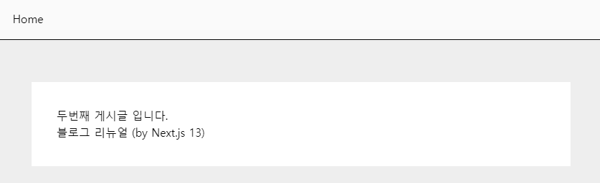
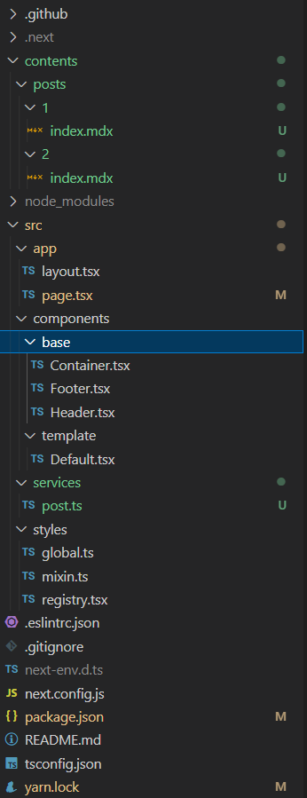
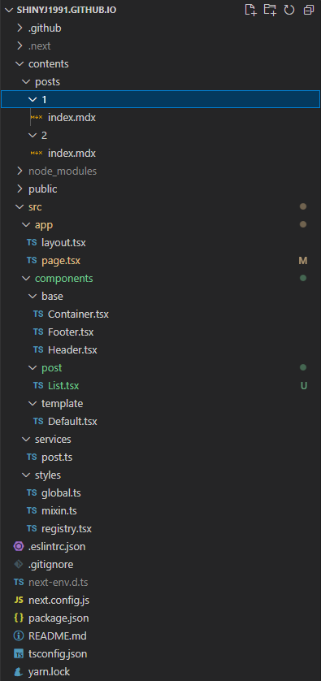

이 글에서는 `mdx` 파일을 탐색하여 블로그 포스팅 목록 페이지를 구성하고 스타일까지 입혀보도록 하겠습니다.

### mdx란?

`mdx`란 마크다운 `md` 에서 jsx component를 사용할 수 있는 마크다운의 상위 집합입니다.

### mdx 파일 생성하기

mdx 파일을 생성해줍니다.
`---` 기호 사이 내용은 `mdx`파일의 `Front Matter` 정보입니다.
문서의 header 역할이라고 보시면 됩니다.

```md:/contents/posts/1/index.mdx
---
title: 블로그 리뉴얼 (by Next.js 13)
date: 2023-08-14T16:01:00
categories: ["next.js", "mdx"]
---

## 인사말

안녕하세요. 이 글은 mdx파일로 작성되었습니다.
```

목록을 그릴때 포스팅이 하나밖에 없으면 아쉬우니 한개 더 생성해 줍니다.

```md:/contents/posts/2/index.mdx
---
title: 두번째 게시글 입니다.
date: 2023-08-14T16:02:00
categories: ["next.js", "mdx"]
---

두번째 게시글 입니다.
```

### mdx 파일 불러오기

이제 `mdx` 파일을 탐색하여 가져오는 `getPosts` 함수를 만들어야합니다.
함수를 만들기 앞서 터미널에 아래 명령어를 입력하여 몇가지 패키지를 설치해줍니다.

```
yarn add @types/glob
yarn add next-mdx-remote
yarn add gray-matter
```

1. `@types/glob` - 패턴과 일치하는 파일들을 탐색합니다.
2. `next-mdx-remote` - next.js 환경에서 mdx파일을 읽어옵니다.
3. `gray-matter` - 문서의 front matter 정보를 읽어옵니다.

패키지 설치가 끝나면 getPosts 함수를 만들겠습니다.

```ts:/src/services/post.ts
import path from "path";
import fs from "fs";
import { sync } from "glob";
import { MDXRemoteSerializeResult } from "next-mdx-remote";
import matter from "gray-matter";
import { serialize } from "next-mdx-remote/serialize";

const BASE_PATH = "/contents/posts";
const POSTS_PATH = path.join(process.cwd(), BASE_PATH);

interface PostMatter {
  title: string;
  date: Date;
  categories: string[];
}

export interface Post extends PostMatter {
  slug: string;
  mdx: MDXRemoteSerializeResult;
}

// mdx 파일을 파싱합니다.
const parsePost = async (postPath: string): Promise<Post> => {
  const file = fs.readFileSync(postPath, "utf8");
  const { data, content } = matter(file);
  const grayMatter = data as PostMatter;
  const slug = postPath
    .slice(postPath.indexOf(BASE_PATH))
    .replace(`${BASE_PATH}/`, "")
    .replace("/index.mdx", "");
  const mdx = await serialize(content, {
    mdxOptions: {
      remarkPlugins: [],
      rehypePlugins: [],
      format: "mdx",
    },
  });

  return {
    ...grayMatter,
    slug,
    mdx,
  };
};

// 타겟 폴더에 있는 모든 mdx 파일을 탐색하여 가져옵니다.
export const getPosts = async (): Promise<Post[]> => {
  const postPaths: string[] = sync(`${POSTS_PATH}/**/*.mdx`);
  const result = await Promise.all(
    postPaths.map((postPath) => {
      return parsePost(postPath);
    })
  );

  // 가져온 mdx파일들을 front matter의 date를 기준으로 내림차순 정렬합니다.
  return result.sort((a: Post, b: Post) => {
    const dateA = a.date;
    const dateB = b.date;

    if (dateA > dateB) return -1;
    if (dateA < dateB) return 1;
    return 0;
  });
};
```

### 포스팅 목록 그리기

이제 `getPosts` 함수로 가져온 포스팅 목록을 그리겠습니다.

```tsx:/src/app/page.tsx
import { getPosts } from "@/services/post";

async function RootPage() {
  const posts = await getPosts();

  return (
    <>
      {posts.length &&
        posts.map((post) => {
          return <div key={post.slug}>{post.title}</div>;
        })}
    </>
  );
}

export default RootPage;
```

여기까지 잘 따라오셨다면 아래와 같은 결과 화면을 볼 수 있습니다.



이제 가져온 포스팅 목록에 스타일을 입혀보겠습니다.
`PostList` component를 만들어줍니다.

```tsx:/src/components/post/List.tsx
"use client";

import Link from "next/link";
import styled from "styled-components";
import { Post } from "@/services/post";

type Props = {
  postList: Post[];
};

function PostList({ postList }: Props) {
  return (
    <StyledPostList>
      {postList.map((post) => {
        return (
          <div key={post.slug} className="post-item">
            <Link href={`/post/${post.slug}`} className="title">
              {post.title}
            </Link>
            <div className="date">{post.date.toISOString()}</div>
            <div className="categories">
              {post.categories.map((category) => {
                return <div key={category}>{category}</div>;
              })}
            </div>
          </div>
        );
      })}
    </StyledPostList>
  );
}

const StyledPostList = styled.div`
  display: grid;
  .post-item {
    padding: 30px 0;
    border-bottom: 1px solid #dddddd;
    &:first-child {
      border-top: 1px solid #dddddd;
    }
    .title {
      font-weight: 500;
      font-size: 20px;
      &:hover {
        color: #1f883d;
      }
    }
    .date {
      font-size: 14px;
      margin-top: 6px;
      color: #666;
    }
    .categories {
      display: flex;
      column-gap: 12px;
      margin-top: 6px;
    }
  }
`;

export default PostList;
```

그런다음 `/src/app/page.tsx` 파일에 PostList를 불러와 포스팅 목록을 props로 내려줍니다.

```tsx:/src/app/page.tsx
import PostList from "@/components/post/List";
import { getPosts } from "@/services/post";

async function RootPage() {
  const posts = await getPosts();

  return (
    <>
      <PostList postList={posts} />
    </>
  );
}

export default RootPage;
```

정상적으로 스타일이 입혀졌습니다.



지금까지의 폴더구조는 아래 캡쳐이미지를 참고해주세요.


