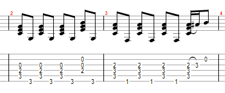

<ScoreWrapper letterSpacing={0.8}>
  <ScorePhrase
    phrase={{
      lyrics: '',
      chordList: [
        { name: 'C/G', position: 0 },
        { name: 'F', position: 20 },
      ],
    }}
  />
  <ScorePhrase
    phrase={{
      lyrics: " Imagine there's no heaven",
      chordList: [
        { name: 'C/G', position: 0 },
        { name: 'F', position: 26 },
      ],
    }}
  />
  <ScorePhrase
    phrase={{
      lyrics: " It's easy if you try",
      chordList: [
        { name: 'C/G', position: 0 },
        { name: 'F', position: 21 },
      ],
    }}
  />
  <ScorePhrase
    phrase={{
      lyrics: ' No hell below us',
      chordList: [
        { name: 'C/G', position: 0 },
        { name: 'F', position: 17 },
      ],
    }}
  />
  <ScorePhrase
    phrase={{
      lyrics: ' Above us, only sky',
      chordList: [
        { name: 'C/G', position: 0 },
        { name: 'F', position: 17 },
      ],
    }}
  />
  <ScorePhrase
    phrase={{
      lyrics: ' Imagine all the people',
      chordList: [
        { name: 'F', position: 0 },
        { name: 'Am', position: 10 },
        { name: 'Dm7', position: 21 },
        { name: 'Dm7/C', position: 25 },
      ],
    }}
  />
  <ScorePhrase
    phrase={{
      lyrics: 'Livin for today - a-hah -',
      chordList: [
        { name: 'G', position: 0 },
        { name: 'G7', position: 14 },
      ],
    }}
  />
  <ScorePhrase
    phrase={{
      lyrics: " Imagine there's no countries",
      chordList: [
        { name: 'C/G', position: 0 },
        { name: 'F', position: 24 },
      ],
    }}
  />
  <ScorePhrase
    phrase={{
      lyrics: " It isn't hard to do",
      chordList: [
        { name: 'C/G', position: 0 },
        { name: 'F', position: 20 },
      ],
    }}
  />
  <ScorePhrase
    phrase={{
      lyrics: ' Nothing to kill or die for',
      chordList: [
        { name: 'C/G', position: 0 },
        { name: 'F', position: 24 },
      ],
    }}
  />
  <ScorePhrase
    phrase={{
      lyrics: ' And no religion, too',
      chordList: [
        { name: 'C/G', position: 0 },
        { name: 'F', position: 21 },
      ],
    }}
  />
  <ScorePhrase
    phrase={{
      lyrics: ' Imagine all the people',
      chordList: [
        { name: 'F', position: 0 },
        { name: 'Am', position: 10 },
        { name: 'Dm7', position: 21 },
        { name: 'Dm7/C', position: 25 },
      ],
    }}
  />
  <ScorePhrase
    phrase={{
      lyrics: 'Livin life in peace - You',
      chordList: [
        { name: 'G', position: 0 },
        { name: 'G7', position: 18 },
      ],
    }}
  />
  <ScorePhrase
    phrase={{
      lyrics: " You may say I'm a dreamer",
      chordList: [
        { name: 'F', position: 0 },
        { name: 'G', position: 9 },
        { name: 'C', position: 19 },
        { name: 'CM7', position: 25 },
        { name: 'E', position: 29 },
        { name: 'E7', position: 33 },
      ],
    }}
  />
  <ScorePhrase
    phrase={{
      lyrics: " But I'm not the only one",
      chordList: [
        { name: 'F', position: 0 },
        { name: 'G', position: 9 },
        { name: 'C', position: 25 },
        { name: 'CM7', position: 27 },
        { name: 'E', position: 31 },
        { name: 'E7', position: 35 },
      ],
    }}
  />
  <ScorePhrase
    phrase={{
      lyrics: " I hope someday you'll join us",
      chordList: [
        { name: 'F', position: 0 },
        { name: 'G', position: 12 },
        { name: 'C', position: 23 },
        { name: 'CM7', position: 29 },
        { name: 'E', position: 34 },
        { name: 'E7', position: 37 },
      ],
    }}
  />
  <ScorePhrase
    phrase={{
      lyrics: ' And the world will be as one',
      chordList: [
        { name: 'F', position: 0 },
        { name: 'G', position: 9 },
        { name: 'C', position: 20 },
      ],
    }}
  />
  <ScorePhrase
    phrase={{
      lyrics: ' Imagine no possessions',
      chordList: [
        { name: 'C/G', position: 0 },
        { name: 'F', position: 23 },
      ],
    }}
  />
  <ScorePhrase
    phrase={{
      lyrics: ' I wonder if you can',
      chordList: [
        { name: 'C/G', position: 0 },
        { name: 'F', position: 20 },
      ],
    }}
  />
  <ScorePhrase
    phrase={{
      lyrics: ' No need for greed or hunger',
      chordList: [
        { name: 'C/G', position: 0 },
        { name: 'F', position: 25 },
      ],
    }}
  />
  <ScorePhrase
    phrase={{
      lyrics: ' A brotherhood of man',
      chordList: [
        { name: 'C/G', position: 0 },
        { name: 'F', position: 21 },
      ],
    }}
  />
  <ScorePhrase
    phrase={{
      lyrics: ' Imagine all the people',
      chordList: [
        { name: 'F', position: 0 },
        { name: 'Am', position: 10 },
        { name: 'Dm7', position: 21 },
        { name: 'Dm7/C', position: 25 },
      ],
    }}
  />
  <ScorePhrase
    phrase={{
      lyrics: 'Sharing all the world - You huh -',
      chordList: [
        { name: 'G', position: 0 },
        { name: 'G7', position: 21 },
      ],
    }}
  />
  <ScorePhrase
    phrase={{
      lyrics: " You may say I'm a dreamer",
      chordList: [
        { name: 'F', position: 0 },
        { name: 'G', position: 9 },
        { name: 'C', position: 25 },
        { name: 'CM7', position: 27 },
        { name: 'E', position: 31 },
        { name: 'E7', position: 35 },
      ],
    }}
  />
  <ScorePhrase
    phrase={{
      lyrics: " But I'm not the only one",
      chordList: [
        { name: 'F', position: 0 },
        { name: 'G', position: 9 },
        { name: 'C', position: 25 },
        { name: 'CM7', position: 27 },
        { name: 'E', position: 31 },
        { name: 'E7', position: 35 },
      ],
    }}
  />
  <ScorePhrase
    phrase={{
      lyrics: " I hope someday you'll join us",
      chordList: [
        { name: 'F', position: 0 },
        { name: 'G', position: 9 },
        { name: 'C', position: 25 },
        { name: 'CM7', position: 27 },
        { name: 'E', position: 31 },
        { name: 'E7', position: 35 },
      ],
    }}
  />
  <ScorePhrase
    phrase={{
      lyrics: ' And the world will live as one',
      chordList: [
        { name: 'F', position: 0 },
        { name: 'G', position: 9 },
        { name: 'C', position: 20 },
      ],
    }}
  />
</ScoreWrapper>

---

